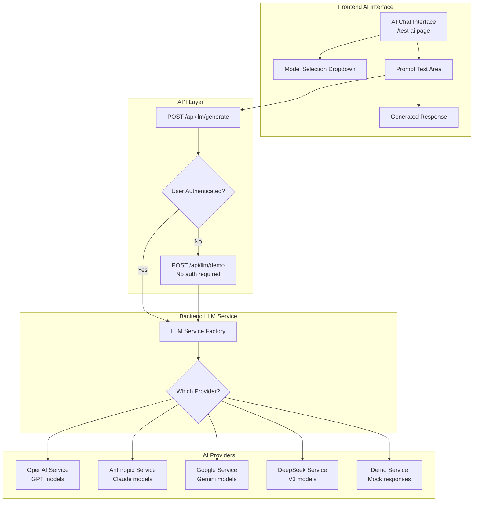

# AI/LLM Integration Guide

> **Purpose**: This guide covers AI and Large Language Model integration in Prompt-Stack, including multiple provider support, model selection, and implementation patterns.

## Supported AI Providers

### Provider Overview

| Provider | Models | Strengths | Cost | Setup Time |
|----------|--------|-----------|------|------------|
| **OpenAI** | GPT-4o, GPT-4, GPT-3.5 | Most capable, reliable | $$$ | 5 min |
| **Anthropic** | Claude 3.5 Sonnet, Claude 3 | Safety-focused, long context | $$$ | 5 min |
| **Google** | Gemini Pro, Gemini Flash | Fast, multimodal | $$ | 10 min |
| **DeepSeek** | DeepSeek V3 | **Extremely cheap** | $ | 5 min |

### Quick Provider Setup

Choose one or more providers by adding API keys:

```bash
# Backend .env file
OPENAI_API_KEY=sk-your-openai-key         # OpenAI models
ANTHROPIC_API_KEY=sk-ant-your-key         # Claude models  
GEMINI_API_KEY=your-gemini-key            # Google models
DEEPSEEK_API_KEY=sk-your-deepseek-key     # DeepSeek models (recommended!)
```

**💡 Recommendation**: Start with DeepSeek ($0.14/M tokens) for development, add others as needed.

## AI Architecture Flow



## Implementation Guide

### Step 1: Add AI Provider API Key

```bash
# Choose your provider and add to backend/.env
DEEPSEEK_API_KEY=sk-your-deepseek-key  # Recommended: cheap and fast
```

### Step 2: Test AI Integration

```bash
# Restart backend to load new API key
docker-compose restart backend

# Test the AI endpoint
curl -X POST http://localhost:8000/api/llm/demo \
  -H "Content-Type: application/json" \
  -d '{"prompt": "Explain quantum computing", "model": "deepseek"}'
```

### Step 3: Use AI in Frontend

Visit `http://localhost:3000/test-ai` to interact with AI models through the web interface.

## Code Implementation

### Backend: Adding New AI Provider

```python
# backend/app/services/llm/llm_service.py

class NewProviderService(LLMService):
    """Implementation for a new AI provider."""
    
    def __init__(self, api_key: str):
        self.api_key = api_key
        # Initialize provider client
    
    async def generate_text(
        self, 
        prompt: str, 
        model: str = "default-model",
        max_tokens: int = 500,
        temperature: float = 0.7
    ) -> LLMResponse:
        """Generate text using the new provider."""
        
        # Make API call to provider
        response = await self.client.generate(
            prompt=prompt,
            model=model,
            max_tokens=max_tokens,
            temperature=temperature
        )
        
        # Return standardized response
        return LLMResponse(
            text=response.text,
            model=model,
            usage=LLMUsage(
                prompt_tokens=response.usage.prompt_tokens,
                completion_tokens=response.usage.completion_tokens,
                total_tokens=response.usage.total_tokens
            )
        )

# Add to provider factory
def get_llm_service() -> LLMService:
    """Get configured LLM service."""
    if settings.NEW_PROVIDER_API_KEY:
        return NewProviderService(settings.NEW_PROVIDER_API_KEY)
    elif settings.OPENAI_API_KEY:
        return OpenAIService(settings.OPENAI_API_KEY)
    # ... other providers
    else:
        # Return demo service if no providers configured
        return DemoService()
```

### Frontend: AI Chat Component

```tsx
// frontend/components/ai/ChatInterface.tsx
import { useState } from 'react'

interface Message {
  role: 'user' | 'assistant'
  content: string
  model?: string
}

export function ChatInterface() {
  const [messages, setMessages] = useState<Message[]>([])
  const [input, setInput] = useState('')
  const [selectedModel, setSelectedModel] = useState('deepseek')
  const [loading, setLoading] = useState(false)

  const sendMessage = async () => {
    if (!input.trim()) return
    
    setLoading(true)
    const userMessage = { role: 'user', content: input }
    setMessages(prev => [...prev, userMessage])
    
    try {
      const response = await fetch('/api/llm/generate', {
        method: 'POST',
        headers: { 'Content-Type': 'application/json' },
        body: JSON.stringify({
          prompt: input,
          model: selectedModel,
          max_tokens: 500,
          temperature: 0.7
        })
      })
      
      const data = await response.json()
      const aiMessage = { 
        role: 'assistant', 
        content: data.data.text,
        model: data.data.model 
      }
      setMessages(prev => [...prev, aiMessage])
      
    } catch (error) {
      console.error('AI generation failed:', error)
    } finally {
      setLoading(false)
      setInput('')
    }
  }

  return (
    <div className="ai-chat-interface">
      <div className="model-selector">
        <select 
          value={selectedModel} 
          onChange={(e) => setSelectedModel(e.target.value)}
        >
          <option value="deepseek">DeepSeek V3 (Cheap)</option>
          <option value="gpt-4o">GPT-4o (Powerful)</option>
          <option value="claude-3-5-sonnet">Claude 3.5 (Safe)</option>
          <option value="gemini-pro">Gemini Pro (Fast)</option>
        </select>
      </div>
      
      <div className="messages">
        {messages.map((msg, idx) => (
          <div key={idx} className={`message ${msg.role}`}>
            <strong>{msg.role}:</strong> {msg.content}
            {msg.model && <span className="model-tag">{msg.model}</span>}
          </div>
        ))}
      </div>
      
      <div className="input-area">
        <textarea
          value={input}
          onChange={(e) => setInput(e.target.value)}
          placeholder="Ask AI anything..."
          rows={3}
        />
        <button onClick={sendMessage} disabled={loading}>
          {loading ? 'Generating...' : 'Send'}
        </button>
      </div>
    </div>
  )
}
```

## Model Configuration

### Default Models per Provider

```python
# backend/app/config/models.py

DEFAULT_MODELS = {
    "openai": "gpt-4o-mini",
    "anthropic": "claude-3-5-sonnet-20241022", 
    "gemini": "gemini-1.5-flash",
    "deepseek": "deepseek-chat"
}

# Model-specific parameters
MODEL_CONFIGS = {
    "gpt-4o": {
        "max_tokens": 4000,
        "supports_system_prompt": True,
        "cost_per_million_tokens": 5.00
    },
    "claude-3-5-sonnet": {
        "max_tokens": 8000,
        "supports_system_prompt": True,
        "cost_per_million_tokens": 3.00
    },
    "deepseek-chat": {
        "max_tokens": 8000,
        "supports_system_prompt": True,
        "cost_per_million_tokens": 0.14  # Extremely cheap!
    }
}
```

### Model Selection Logic

```python
def get_model_for_task(task: str, provider: str = None) -> str:
    """Get optimal model for specific task."""
    
    task_models = {
        "chat": "deepseek-chat",        # Cheap for conversations
        "coding": "gpt-4o",             # Best for code generation
        "analysis": "claude-3-5-sonnet", # Best for analysis
        "creative": "gpt-4o",           # Creative writing
        "summarization": "gemini-flash"  # Fast for summaries
    }
    
    return task_models.get(task, "deepseek-chat")
```

## Advanced Features

### Streaming Responses

```python
# Backend: Streaming endpoint
@router.post("/stream")
async def stream_generate(request: StreamRequest):
    """Generate streaming AI response."""
    
    async def generate_stream():
        llm_service = get_llm_service()
        async for chunk in llm_service.stream_generate(
            prompt=request.prompt,
            model=request.model
        ):
            yield f"data: {json.dumps({'text': chunk})}\n\n"
    
    return StreamingResponse(
        generate_stream(),
        media_type="text/plain"
    )
```

```javascript
// Frontend: Consume streaming response
const streamResponse = async (prompt) => {
  const response = await fetch('/api/llm/stream', {
    method: 'POST',
    headers: { 'Content-Type': 'application/json' },
    body: JSON.stringify({ prompt, model: 'deepseek' })
  })
  
  const reader = response.body.getReader()
  const decoder = new TextDecoder()
  
  while (true) {
    const { done, value } = await reader.read()
    if (done) break
    
    const chunk = decoder.decode(value)
    const lines = chunk.split('\n')
    
    for (const line of lines) {
      if (line.startsWith('data: ')) {
        const data = JSON.parse(line.slice(6))
        // Update UI with streaming text
        updateChatMessage(data.text)
      }
    }
  }
}
```

### Usage Tracking

```python
# Track AI usage per user
@router.post("/generate")
async def generate_text(
    request: LLMRequest,
    current_user: AuthUser = Depends(get_current_user)
):
    """Generate text with usage tracking."""
    
    llm_service = get_llm_service()
    response = await llm_service.generate_text(
        prompt=request.prompt,
        model=request.model
    )
    
    # Track usage in database
    await track_llm_usage(
        user_id=current_user.id,
        provider=response.provider,
        model=response.model,
        prompt_tokens=response.usage.prompt_tokens,
        completion_tokens=response.usage.completion_tokens,
        cost_cents=calculate_cost(response.usage, response.model)
    )
    
    return success_response(response)
```

### Vector Embeddings

```python
# Generate embeddings for semantic search
@router.post("/embed")
async def create_embedding(request: EmbedRequest):
    """Create vector embeddings for text."""
    
    embedding_service = get_embedding_service()
    vector = await embedding_service.embed_text(request.text)
    
    # Store in vector database
    await vector_db.store_embedding(
        text=request.text,
        vector=vector,
        metadata=request.metadata
    )
    
    return success_response({"vector": vector})

# Search similar content
@router.post("/search")
async def semantic_search(request: SearchRequest):
    """Search for similar content using embeddings."""
    
    query_vector = await embedding_service.embed_text(request.query)
    results = await vector_db.similarity_search(
        vector=query_vector,
        limit=request.limit
    )
    
    return success_response(results)
```

## Cost Optimization

### Provider Cost Comparison

```python
# Cost calculation helper
def calculate_usage_cost(tokens: int, model: str) -> float:
    """Calculate cost for token usage."""
    
    costs_per_million = {
        "gpt-4o": 5.00,
        "gpt-4o-mini": 0.15,
        "claude-3-5-sonnet": 3.00,
        "gemini-1.5-flash": 0.075,
        "deepseek-chat": 0.14  # Cheapest option!
    }
    
    cost_per_token = costs_per_million.get(model, 1.0) / 1_000_000
    return tokens * cost_per_token
```

### Smart Model Routing

```python
def route_to_optimal_model(
    prompt: str, 
    task_type: str,
    budget_priority: bool = True
) -> str:
    """Route to optimal model based on task and budget."""
    
    if budget_priority:
        # Use DeepSeek for most tasks when budget matters
        return "deepseek-chat"
    
    # Use best model for each task type
    optimal_models = {
        "coding": "gpt-4o",
        "creative": "claude-3-5-sonnet", 
        "analysis": "claude-3-5-sonnet",
        "chat": "deepseek-chat",
        "summarization": "gemini-1.5-flash"
    }
    
    return optimal_models.get(task_type, "deepseek-chat")
```

## Error Handling

### Graceful Fallbacks

```python
async def generate_with_fallback(
    prompt: str, 
    preferred_model: str
) -> LLMResponse:
    """Generate text with automatic fallback to other providers."""
    
    providers = [
        ("deepseek", "deepseek-chat"),
        ("openai", "gpt-4o-mini"),
        ("anthropic", "claude-3-5-sonnet"),
        ("demo", "demo-model")  # Always available fallback
    ]
    
    for provider, model in providers:
        try:
            service = get_provider_service(provider)
            if service:
                return await service.generate_text(prompt, model)
        except Exception as e:
            logger.warning(f"Provider {provider} failed: {e}")
            continue
    
    raise Exception("All AI providers unavailable")
```

## Demo Mode

When no AI providers are configured, the system automatically uses demo mode:

```python
class DemoService(LLMService):
    """Demo AI service that generates realistic responses."""
    
    async def generate_text(self, prompt: str, **kwargs) -> LLMResponse:
        """Generate demo response with simulated latency."""
        
        responses = [
            "This is a demo AI response. Configure real API keys to use actual AI models.",
            f"I received your prompt: '{prompt[:50]}...' - This is simulated AI output.",
            "Demo mode is active. Add OPENAI_API_KEY or other provider keys to enable real AI."
        ]
        
        # Simulate realistic API latency
        await asyncio.sleep(random.uniform(0.5, 2.0))
        
        return LLMResponse(
            text=random.choice(responses),
            model="demo",
            usage=LLMUsage(
                prompt_tokens=len(prompt.split()),
                completion_tokens=random.randint(20, 100),
                total_tokens=len(prompt.split()) + random.randint(20, 100)
            )
        )
```

## Testing AI Integration

### API Testing

```bash
# Test available providers
curl http://localhost:8000/api/llm/providers

# Test demo generation (no auth required)
curl -X POST http://localhost:8000/api/llm/demo \
  -H "Content-Type: application/json" \
  -d '{"prompt": "Write a haiku about coding", "model": "demo"}'

# Test real generation (requires auth)
curl -X POST http://localhost:8000/api/llm/generate \
  -H "Content-Type: application/json" \
  -H "Authorization: Bearer your-jwt-token" \
  -d '{"prompt": "Explain machine learning", "model": "deepseek"}'
```

### Frontend Testing

1. Visit `http://localhost:3000/test-ai`
2. Try different models and prompts
3. Check response times and quality
4. Monitor usage and costs

---

**Next Steps**:
- See `GETTING_STARTED.md` for basic setup
- See `ARCHITECTURE_OVERVIEW.md` for system design
- See `DEPLOYMENT_GUIDE.md` for production AI setup