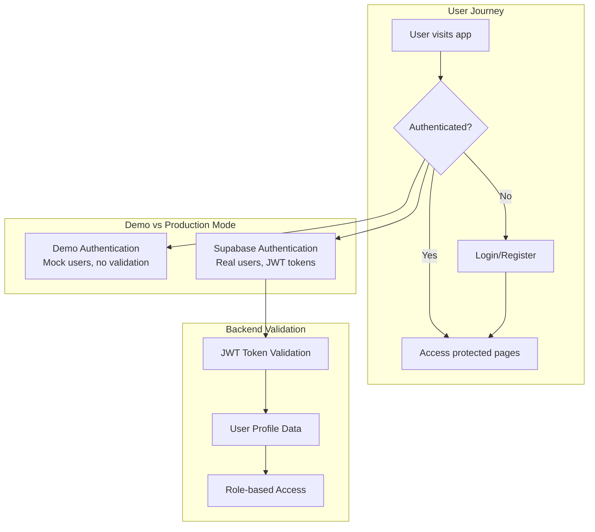

# Architecture Overview

> **Purpose**: This guide covers the complete system architecture of Prompt-Stack, including authentication flows, AI integration, and component relationships.

## System Architecture Diagram

```
┌─────────────────────────────────────────────────────────────────┐
│                        Frontend (Next.js)                       │
├─────────────────────────────────────────────────────────────────┤
│  ┌─────────────┐  ┌─────────────┐  ┌─────────────┐  ┌─────────┐ │
│  │    Pages    │  │ Components  │  │  Services   │  │  Hooks  │ │
│  │             │  │             │  │             │  │         │ │
│  │ • Landing   │  │ • AuthForm  │  │ • API calls │  │ • Theme │ │
│  │ • Auth      │  │ • Navigation│  │ • Supabase  │  │ • Auth  │ │
│  │ • Dashboard │  │ • AI Chat   │  │ • LLM proxy │  │ • API   │ │
│  │ • AI Test   │  │ • Forms     │  │             │  │         │ │
│  └─────────────┘  └─────────────┘  └─────────────┘  └─────────┘ │
└─────────────────────────────────────────────────────────────────┘
                                 │
                                 │ HTTP/WebSocket
                                 ▼
┌─────────────────────────────────────────────────────────────────┐
│                        Backend (FastAPI)                        │
├─────────────────────────────────────────────────────────────────┤
│  ┌─────────────┐  ┌─────────────┐  ┌─────────────┐  ┌─────────┐ │
│  │ API Endpoints│  │  Services   │  │   Models    │  │  Core   │ │
│  │             │  │             │  │             │  │         │ │
│  │ • /auth     │  │ • LLM       │  │ • Pydantic  │  │ • Config│ │
│  │ • /llm      │  │ • Auth      │  │ • User      │  │ • Auth  │ │
│  │ • /payments │  │ • Vector    │  │ • Payment   │  │ • Demo  │ │
│  │ • /admin    │  │ • Supabase  │  │ • LLM       │  │ • Utils │ │
│  └─────────────┘  └─────────────┘  └─────────────┘  └─────────┘ │
└─────────────────────────────────────────────────────────────────┘
                                 │
                                 │ Database/External APIs
                                 ▼
┌─────────────────────────────────────────────────────────────────┐
│                      External Services                          │
├─────────────────────────────────────────────────────────────────┤
│  ┌─────────────┐  ┌─────────────┐  ┌─────────────┐  ┌─────────┐ │
│  │  Supabase   │  │  AI Models  │  │  Payments   │  │ Vector  │ │
│  │             │  │             │  │             │  │   DB    │ │
│  │ • Auth      │  │ • OpenAI    │  │ • Stripe    │  │ • Search│ │
│  │ • PostgreSQL│  │ • Anthropic │  │ • LemonSqzy │  │ • Embed │ │
│  │ • Storage   │  │ • Gemini    │  │             │  │         │ │
│  │ • Realtime  │  │ • DeepSeek  │  │             │  │         │ │
│  └─────────────┘  └─────────────┘  └─────────────┘  └─────────┘ │
└─────────────────────────────────────────────────────────────────┘
```

## Authentication Architecture

### Authentication Flow



### Authentication Components

**Frontend (`/components/providers/auth-provider.tsx`)**:
- Manages authentication state globally
- Handles login/logout flows
- Provides `useAuth()` hook for components
- Auto-detects demo vs production mode

**Backend (`/app/core/auth.py`)**:
- JWT token validation
- User role management
- Protected route decorators
- Demo mode bypass logic

**Database (`profiles` table)**:
- Extends Supabase auth.users
- Stores user metadata and preferences
- Role-based access control (RBAC)

## AI/LLM Architecture

### LLM Integration Flow

```mermaid
graph TB
    subgraph "Frontend AI Interface"
        AIForm[AI Chat Interface]
        ModelSelect[Model Selection]
        PromptInput[Prompt Input]
        
        AIForm --> ModelSelect
        AIForm --> PromptInput
    end
    
    subgraph "Backend LLM Service"
        LLMRouter[/api/llm endpoints]
        ProviderFactory[LLM Provider Factory]
        OpenAI[OpenAI Service]
        Anthropic[Anthropic Service]
        Gemini[Gemini Service]
        DeepSeek[DeepSeek Service]
        
        LLMRouter --> ProviderFactory
        ProviderFactory --> OpenAI
        ProviderFactory --> Anthropic
        ProviderFactory --> Gemini
        ProviderFactory --> DeepSeek
    end
    
    subgraph "Provider Selection Logic"
        ConfigCheck{API Key<br/>Configured?}
        DemoMode[Demo Response]
        RealAPI[External API Call]
        
        ProviderFactory --> ConfigCheck
        ConfigCheck -->|No| DemoMode
        ConfigCheck -->|Yes| RealAPI
    end
```

### AI Service Components

**Provider Abstraction (`/services/llm/llm_service.py`)**:
- Unified interface for all AI providers
- Automatic provider detection based on API keys
- Rate limiting and usage tracking
- Error handling and fallback logic

**Model Configuration (`/config/models.py`)**:
- Default model mappings per provider
- Model-specific parameter handling
- Cost optimization recommendations

**Demo Mode (`/core/demo.py`)**:
- Generates realistic demo responses
- Simulates API latency and usage
- No external API calls required

## Database Architecture

### Core Tables

```sql
-- User Management (extends Supabase auth)
profiles (
  id uuid PRIMARY KEY REFERENCES auth.users,
  email varchar,
  full_name varchar,
  avatar_url varchar,
  role varchar DEFAULT 'user',
  created_at timestamp,
  updated_at timestamp
)

-- AI Usage Tracking
llm_requests (
  id uuid PRIMARY KEY,
  user_id uuid REFERENCES profiles(id),
  provider varchar,
  model varchar,
  prompt_tokens integer,
  completion_tokens integer,
  cost_cents integer,
  created_at timestamp
)

-- Vector Storage (pgvector)
embeddings (
  id uuid PRIMARY KEY,
  user_id uuid REFERENCES profiles(id),
  content text,
  embedding vector(1536),
  metadata jsonb,
  created_at timestamp
)
```

### Row Level Security (RLS)

All tables use Supabase RLS for data isolation:
- Users can only access their own data
- Admins have elevated permissions
- Demo mode bypasses RLS entirely

## API Architecture

### Endpoint Organization

```
/api/
├── auth/           # Authentication endpoints
│   ├── demo/       # Demo auth (no validation)
│   ├── register    # User registration
│   ├── login       # User login
│   └── logout      # User logout
├── llm/            # AI/LLM endpoints
│   ├── generate    # Text generation (protected)
│   ├── demo        # Demo generation (public)
│   ├── providers   # Available providers
│   └── models      # Available models
├── admin/          # Admin-only endpoints
│   ├── users       # User management
│   └── analytics   # Usage analytics
├── payments/       # Payment configuration
│   ├── stripe/     # Stripe status
│   └── lemonsqueezy/ # Lemon Squeezy status
└── health/         # System health checks
```

### Middleware Stack

1. **CORS Middleware**: Cross-origin request handling
2. **Rate Limiting**: Per-user request limits
3. **Authentication**: JWT validation for protected routes
4. **Error Handling**: Standardized error responses
5. **Request Logging**: Structured logging for debugging

## Configuration Management

### Environment-Based Configuration

**Demo Mode (Default)**:
- No external services required
- Mock authentication and AI responses
- In-memory data storage
- Perfect for development and testing

**Production Mode**:
- Requires external API keys
- Real authentication via Supabase
- PostgreSQL database with pgvector
- Rate limiting and usage tracking

### Auto-Detection Logic

```python
# Automatic mode detection in settings.py
@property
def is_demo_mode(self) -> bool:
    has_auth = bool(self.SUPABASE_URL and self.SUPABASE_ANON_KEY)
    has_ai = bool(
        self.OPENAI_API_KEY or 
        self.ANTHROPIC_API_KEY or 
        self.GEMINI_API_KEY or 
        self.DEEPSEEK_API_KEY
    )
    return not (has_auth or has_ai)  # Demo if nothing configured
```

## Development Patterns

### Code Organization

- **Services**: Business logic abstraction
- **Models**: Pydantic data validation
- **Endpoints**: API route handlers
- **Core**: Shared utilities and configuration
- **Middleware**: Request/response processing

### Error Handling

- Standardized error responses across all endpoints
- Graceful degradation when services are unavailable
- Detailed logging for debugging
- User-friendly error messages

### Testing Strategy

- Unit tests for core business logic
- Integration tests for API endpoints
- End-to-end tests for user flows
- Demo mode for quick testing without external dependencies

## Deployment Architecture

### Container Strategy

```dockerfile
# Multi-stage builds for production optimization
# Separate containers for frontend and backend
# Health checks for container orchestration
# Resource limits for production scaling
```

### Platform Support

- **Railway**: Backend deployment with automatic builds
- **Vercel**: Frontend deployment with edge optimization
- **Docker**: Local development and custom deployments
- **Render/Fly.io**: Alternative deployment options

## Security Architecture

### Authentication Security

- JWT tokens with expiration
- Secure HTTP-only cookies (optional)
- CORS protection for API endpoints
- Rate limiting to prevent abuse

### Data Security

- Row Level Security (RLS) in database
- API key encryption in environment variables
- No sensitive data in client-side code
- Secure webhook signature validation

### Operational Security

- Health checks for monitoring
- Structured logging for audit trails
- Error boundaries to prevent data leaks
- Automatic security headers

---

**Next Steps**: 
- Read `AUTHENTICATION_GUIDE.md` for detailed auth implementation
- Read `AI_LLM_INTEGRATION.md` for AI features
- Read `DEPLOYMENT_GUIDE.md` for production setup