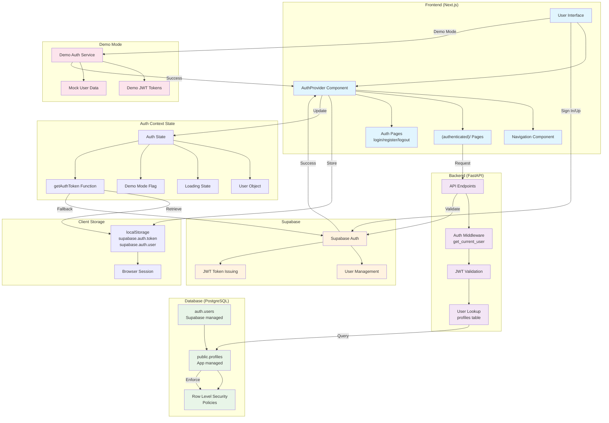
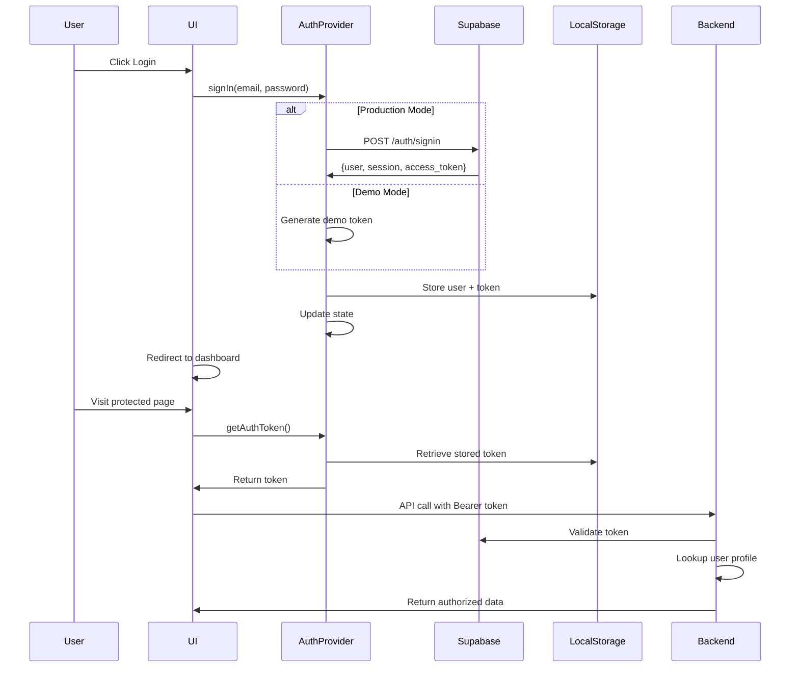
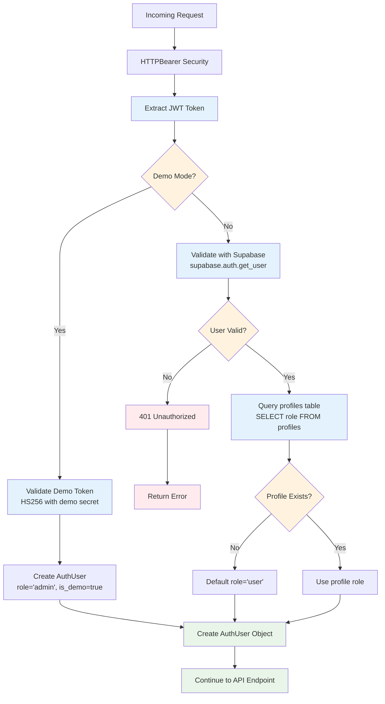
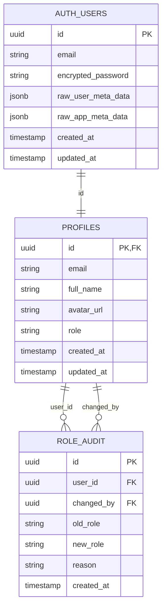
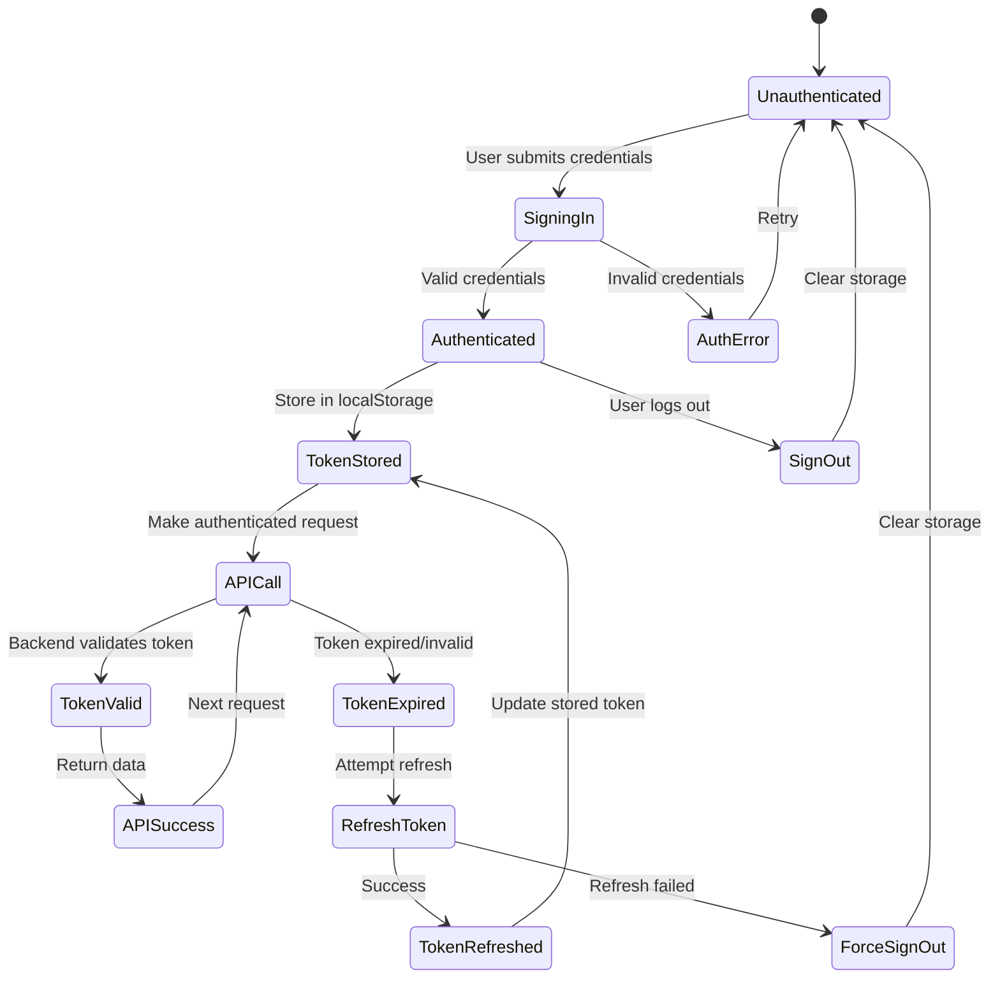
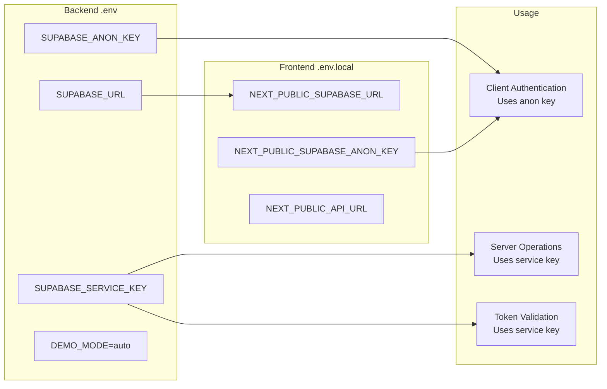

# Authentication Architecture

## Complete Auth Flow Diagram



## Detailed Component Breakdown

### Frontend Authentication Flow



### Backend Authentication Middleware



### Database Schema & Security



### Row Level Security Policies

```mermaid
graph TB
    subgraph "Profiles Table RLS"
        ViewPolicy[Public profiles viewable by everyone<br/>POLICY FOR SELECT USING true]
        UpdateOwnPolicy[Users can update own profile<br/>POLICY FOR UPDATE USING auth.uid() = id]
        AdminUpdatePolicy[Admins can update any profile<br/>POLICY FOR UPDATE USING is_admin()]
        DeletePolicy[Admins can delete other profiles<br/>POLICY FOR DELETE USING auth.uid() != id AND is_admin()]
    end
    
    subgraph "Role Audit RLS"
        AdminViewAudit[Only admins can view audit logs<br/>POLICY FOR SELECT USING is_admin()]
    end
    
    subgraph "Security Functions"
        IsAdmin["is_admin(user_id) → boolean<br/>Check if user has admin/super_admin role"]
        HasRole["has_role(role, user_id) → boolean<br/>Check specific role permissions"]
        CheckAdminEmail["check_admin_email(email, admin_emails[]) → boolean<br/>Validate against ADMIN_EMAILS config"]
    end

    ViewPolicy --> IsAdmin
    UpdateOwnPolicy --> IsAdmin
    AdminUpdatePolicy --> IsAdmin
    DeletePolicy --> IsAdmin
    AdminViewAudit --> IsAdmin
    
    IsAdmin --> HasRole
    HasRole --> CheckAdminEmail
```

### Token Lifecycle



## Key Security Features

### 1. **JWT Token Validation**
- Production: Supabase validates tokens with proper cryptographic verification
- Demo: HS256 with demo secret key (development only)
- Automatic expiry handling with refresh token flow

### 2. **Role-Based Access Control**
- Three roles: `user`, `admin`, `super_admin`
- Hierarchical permissions (admin includes user permissions)
- Database-enforced with RLS policies

### 3. **Row Level Security**
- All user data protected by RLS policies
- Users can only access their own data
- Admins have elevated permissions where appropriate
- Audit trail for sensitive operations (role changes)

### 4. **Defense in Depth**
- Frontend auth state management
- Backend JWT validation
- Database RLS enforcement
- Service key vs anon key separation

### 5. **Demo Mode Security**
- Completely isolated from production auth
- Uses separate token validation
- All demo users get admin privileges
- No real data exposure

## Environment Configuration



This architecture provides:
- **Secure by default** with RLS and JWT validation
- **Flexible role management** with audit trails  
- **Development-friendly** with demo mode
- **Scalable** with proper separation of concerns
- **Production-ready** with comprehensive security layers